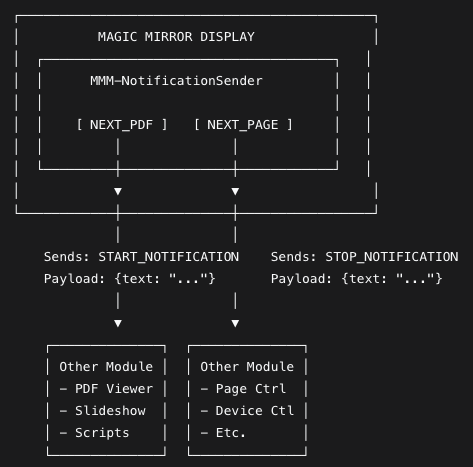

# MMM-NotificationSender

A simple notification sender module for MagicMirror² that provides a customizable UI with buttons to send notifications to other modules.

## Features

- **Two Customizable Buttons**: Creates "Start" and "Stop" buttons (labels configurable via button text)
- **Custom Notifications**: Sends configurable notification names with text payloads
- **Easy Integration**: Other modules can listen and react to these notifications
- **Flexible Configuration**: All button texts, notification names, and payloads are configurable

## Installation

1. Navigate to your MagicMirror `modules` directory:
```
cd ~/MagicMirror/modules
```

2. Clone this repository:
```
git clone https://github.com/yourusername/MMM-NotificationSender.git
```

3. Add the module to your `config/config.js` file.

## Configuration

Add the module to your MagicMirror configuration:

```javascript
{
    module: "MMM-NotificationSender",
    position: "bottom_center", // Any position
    config: {
        startNotification: "START_NOTIFICATION",
        stopNotification: "STOP_NOTIFICATION",
        startText: "This is a start notification.",
        stopText: "This is a stop notification.",
        startButtonText: "NEXT_PDF",     // Text for first button
        stopButtonText: "NEXT_PAGE"      // Text for second button
    }
}
```

### Configuration Options

| Option | Default | Description |
|--------|---------|-------------|
| `startNotification` | `"START_NOTIFICATION"` | Notification name sent by first button |
| `stopNotification` | `"STOP_NOTIFICATION"` | Notification name sent by second button |
| `startText` | `"This is a start notification."` | Payload text sent with start notification |
| `stopText` | `"This is a stop notification."` | Payload text sent with stop notification |
| `startButtonText` | `"NEXT_PDF"` | Display text on first button |
| `stopButtonText` | `"NEXT_PAGE"` | Display text on second button |

## How Other Modules Can Use It

Other modules can receive these notifications:

```javascript
notificationReceived: function(notification, payload, sender) {
    if (notification === "START_NOTIFICATION") {
        console.log("Start notification received with payload:", payload.text);
        // Your logic here
    }
    if (notification === "STOP_NOTIFICATION") {
        console.log("Stop notification received with payload:", payload.text);
        // Your logic here
    }
}
```

## Use Cases

- **Presentation Control**: Navigate through PDFs or slides
- **Device Control**: Trigger external actions or scripts
- **Module Communication**: Coordinate between different MagicMirror modules
- **Custom Interfaces**: Create simple control panels for your mirror

## Screenshot



*Example: Two buttons labeled "NEXT_PDF" and "NEXT_PAGE"*

## Dependencies

- [MagicMirror²](https://github.com/MichMich/MagicMirror) (v2.0 or higher)

## License

This module is licensed under the MIT License.
